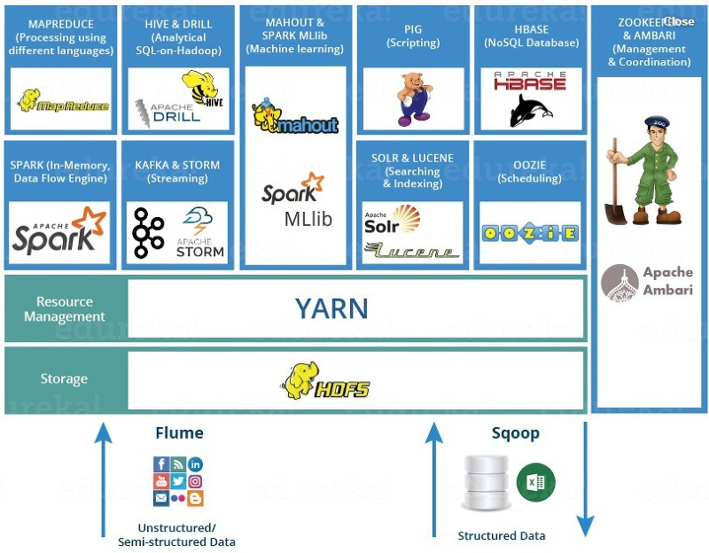

# Hadoop #

The Apache™ Hadoop® project develops open-source software for reliable, scalable, distributed computing.

The Apache Hadoop software library is a framework that allows for the distributed processing of large data sets across clusters of computers using simple programming models. It is designed to scale up from single servers to thousands of machines, each offering local computation and storage. Rather than rely on hardware to deliver high-availability, the library itself is designed to detect and handle failures at the application layer, so delivering a highly-available service on top of a cluster of computers, each of which may be prone to failures.

## ECOSystem ##



### HDFS(Hadoop Distributed File System) ###

A distributed file system that provides high-throughput access to application data.

HDFS provides high throughput access to application data and is suitable for applications that have large data sets. HDFS relaxes a few POSIX requirements to enable streaming access to file system data. HDFS was originally built as infrastructure for the Apache Nutch web search engine project. HDFS is part of the Apache Hadoop Core project.


#### **NameNode and DataNode** ####

- HDFS has a master/slave architecture. An HDFS cluster consists of a single NameNode, a master server that manages the file system namespace and regulates access to files by clients. In addition, there are a number of DataNodes, usually one per node in the cluster, which manage storage attached to the nodes that they run on. HDFS exposes a file system namespace and allows user data to be stored in files. Internally, a file is split into one or more blocks and these blocks are stored in a set of DataNodes. The NameNode executes file system namespace operations like opening, closing, and renaming files and directories. It also determines the mapping of blocks to DataNodes. The DataNodes are responsible for serving read and write requests from the file system’s clients. The DataNodes also perform block creation, deletion, and replication upon instruction from the NameNode.
- The NameNode and DataNode are pieces of software designed to run on commodity machines. These machines typically run a GNU/Linux operating system (OS). HDFS is built using the Java language; any machine that supports Java can run the NameNode or the DataNode software. Usage of the highly portable Java language means that HDFS can be deployed on a wide range of machines. A typical deployment has a dedicated machine that runs only the NameNode software. Each of the other machines in the cluster runs one instance of the DataNode software. The architecture does not preclude running multiple DataNodes on the same machine but in a real deployment that is rarely the case.
The existence of a single NameNode in a cluster greatly simplifies the architecture of the system. The NameNode is the arbitrator and repository for all HDFS metadata. The system is designed in such a way that user data never flows through the NameNode.

#### **The File System Namespace** ####

- HDFS supports a traditional hierarchical file organization. A user or an application can create directories and store files inside these directories. The file system namespace hierarchy is similar to most other existing file systems; one can create and remove files, move a file from one directory to another, or rename a file.

The **NameNode** maintains the file system namespace. Any change to the file system namespace or its properties is recorded by the NameNode. An application can specify the number of replicas of a file that should be maintained by HDFS. The number of copies of a file is called the replication factor of that file. This information is stored by the NameNode.

```console
> hadoop fs -mkdir test
> hadoop fs -ls
> hadoop fs -mv
```

[HDFS commands](https://hadoop.apache.org/docs/stable/hadoop-project-dist/hadoop-common/FileSystemShell.html)

[Commands manual]([https://](https://hadoop.apache.org/docs/stable/hadoop-project-dist/hadoop-common/CommandsManual.html))

<details>
  <summary>HDFS supported commands</summary>

```bash
Usage: hadoop fs [generic options]
        [-appendToFile <localsrc> ... <dst>]
        [-cat [-ignoreCrc] <src> ...]
        [-checksum <src> ...]
        [-chgrp [-R] GROUP PATH...]
        [-chmod [-R] <MODE[,MODE]... | OCTALMODE> PATH...]
        [-chown [-R] [OWNER][:[GROUP]] PATH...]
        [-copyFromLocal [-f] [-p] [-l] <localsrc> ... <dst>]
        [-copyToLocal [-p] [-ignoreCrc] [-crc] <src> ... <localdst>]
        [-count [-q] [-h] [-v] [-t [<storage type>]] [-u] <path> ...]
        [-cp [-f] [-p | -p[topax]] <src> ... <dst>]
        [-createSnapshot <snapshotDir> [<snapshotName>]]
        [-deleteSnapshot <snapshotDir> <snapshotName>]
        [-df [-h] [<path> ...]]
        [-du [-s] [-h] <path> ...]
        [-expunge]
        [-find <path> ... <expression> ...]
        [-get [-p] [-ignoreCrc] [-crc] <src> ... <localdst>]
        [-getfacl [-R] <path>]
        [-getfattr [-R] {-n name | -d} [-e en] <path>]
        [-getmerge [-nl] <src> <localdst>]
        [-help [cmd ...]]
        [-ls [-C] [-d] [-h] [-q] [-R] [-t] [-S] [-r] [-u] [<path> ...]]
        [-mkdir [-p] <path> ...]
        [-moveFromLocal <localsrc> ... <dst>]
        [-moveToLocal <src> <localdst>]
        [-mv <src> ... <dst>]
        [-put [-f] [-p] [-l] <localsrc> ... <dst>]
        [-renameSnapshot <snapshotDir> <oldName> <newName>]
        [-rm [-f] [-r|-R] [-skipTrash] [-safely] <src> ...]
        [-rmdir [--ignore-fail-on-non-empty] <dir> ...]
        [-setfacl [-R] [{-b|-k} {-m|-x <acl_spec>} <path>]|[--set <acl_spec> <path>]]
        [-setfattr {-n name [-v value] | -x name} <path>]
        [-setrep [-R] [-w] <rep> <path> ...]
        [-stat [format] <path> ...]
        [-tail [-f] <file>]
        [-test -[defsz] <path>]
        [-text [-ignoreCrc] <src> ...]
        [-touchz <path> ...]
        [-truncate [-w] <length> <path> ...]
        [-usage [cmd ...]]

Generic options supported are
-conf <configuration file>     specify an application configuration file
-D <property=value>            use value for given property
-fs <local|namenode:port>      specify a namenode
-jt <local|resourcemanager:port>    specify a ResourceManager
-files <comma separated list of files>    specify comma separated files to be copied to the map reduce cluster
-libjars <comma separated list of jars>    specify comma separated jar files to include in the classpath.
-archives <comma separated list of archives>    specify comma separated archives to be unarchived on the compute machines.
```

</details>

[HDFS Quota link]([https://](https://hadoop.apache.org/docs/stable/hadoop-project-dist/hadoop-hdfs/HdfsQuotaAdminGuide.html))

----------

#### **Data Replication** ####

HDFS is designed to reliably store very large files across machines in a large cluster. It stores each file as a sequence of blocks. The blocks of a file are replicated for fault tolerance. The block size and replication factor are configurable per file.

All blocks in a file except the last block are the same size, while users can start a new block without filling out the last block to the configured block size after the support for variable length block was added to append and hsync.

An application can specify the number of replicas of a file. The replication factor can be specified at file creation time and can be changed later. Files in HDFS are write-once (except for appends and truncates) and have strictly one writer at any time.

The NameNode makes all decisions regarding replication of blocks. It periodically receives a Heartbeat and a Blockreport from each of the DataNodes in the cluster. Receipt of a Heartbeat implies that the DataNode is functioning properly. A Blockreport contains a list of all blocks on a DataNode.

#### **The Persistence of File System Metadata** ####

#### **The Communication Protocols** ####

#### **Robustness** ####

#### **Data Organization** ####

#### **Accessibility** ####

#### **Space Reclamation** ####

----------

### MapReduce ###
